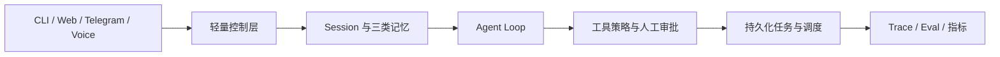

# Waku 产品路线

更新时间：2026-07-19

Waku 继续做本地优先的通用个人 Agent。Eval 只服务 Waku 自身的开发、发布和模型选择，不扩成面向外部用户的评测平台。默认运行路径仍要清楚、可读，新能力放进独立模块，通过测试和运行证据接入现有 Agent Loop。

## 当前基线

| 简历能力 | 当前状态 | 已有证据 | 还缺什么 |
|---|---|---|---|
| Agent 运行时与多端接入 | 部分完成 | 流式输出、多轮工具调用、最大迭代保护、会话恢复；9 个模型提供方；CLI、Web、Telegram、Voice | 通用高风险动作审批 |
| 轻量模型控制层与三类记忆 | 部分完成 | 检索门控、SQLite FTS5 事实记忆、情景记忆、SKILL.md、批量巩固 | 请求分流、缺参判断、风险分类、中文检索修复、路由效果指标 |
| 执行轨迹级 Eval | 部分完成 | 143 项离线确定性检查；11 条 live task cases；2 项 Judge 检查；模型重复运行脚本 | 人工复核数据集、开发集与留出集、统一 run artifact、失败聚类、回归台账 |
| ECS 长期运行 | 未完成 | JSONL、OpenTelemetry、成本账本、Telegram 长轮询 | Docker、远程访问保护、持久化任务、定时触发、中断恢复、健康检查、备份和真实使用数据 |

当前主链如下：

## M0：固定目标与证据口径

本阶段保存完成态简历，并把每条表述映射到代码、测试、部署产物或运行数据。简历中的数字可以暂时占位，功能不能占位。

完成标准：

- `docs/resume.zh-CN.md` 保存完成态目标稿。
- 本文记录当前基线、依赖顺序和指标定义。
- 后续每个里程碑都能明确解锁哪条简历表述。

## M1：先建立小而可信的评测基线

在改变路由、记忆和任务运行方式之前，先记录当前表现。评测代码继续留在 `evals/`，不增加通用平台、服务端或实验管理界面。

交付内容：

- 将任务集扩充到 40 条人工复核任务，覆盖简单问答、记忆写入与召回、日程安排、Skill 工作流、多工具任务、风险动作和恢复流程。
- 使用 `split` 字段固定 24 条开发任务和 16 条留出任务。Prompt、路由与 Skill 只根据开发集修改。
- 每次运行保存任务输入、模型与 Prompt 版本、控制层决策、工具调用、最终回复、token、延迟、成本和 verdict，形成一个可复查的 run artifact。
- 确定性断言检查工具路径、参数、副作用和任务状态；LLM Judge 只判断最终回复，不参与确定性真值。
- 将失败归入 routing、retrieval、skill、tool_args、safety、recovery、response 七类，形成可累计的回归台账。
- 修正 release gate 的语义。没有 Judge key 时只报告 deterministic pass 和 judge skipped，不再把它表述为完整语义门禁通过。

完成标准：3 个代表性模型各重复 3 次，产出一份冻结的 baseline 报告。报告必须保留失败样本，不能只保留汇总分数。

## M2：把检索门控升级为轻量控制层

现有小模型调用只回答是否检索记忆。下一步把它收敛成一个结构化 Turn Decision，一次决策覆盖请求分流、检索、缺参和风险，避免再叠加多个分类调用。

交付内容：

- 新增独立控制模块，输出 `route`、`retrieve`、`query`、`missing_fields`、`risk` 和 `reason`。
- 安全且无需工具的简单请求由轻量模型直接回答；工具任务、复杂推理和 Skill 工作流进入主模型 Agent Loop。
- 控制层解析失败时回退主模型，不能丢请求；所有决策写入现有 JSONL 与 OpenTelemetry 轨迹。
- 修复当前 FTS 查询预处理不保留中文字符的问题，补充中文事实、别名、日期与跨轮召回测试。
- 给事实写入增加去重、更新和来源字段，避免周期性巩固不断写入同义事实。
- 让 Skill 选择复用控制层决策，保留 SKILL.md 按需加载，不把全部 Skill 正文塞入系统提示。

完成标准：在冻结留出集成功率不下降的前提下，统计单任务主模型调用次数和单个成功任务成本的变化，同时单独报告记忆相关留出任务成功率。

## M3：补齐人工审批与持久化任务

持久化边界放在工具调用之间。Waku 不承诺恢复模型生成到一半的 token，而是恢复尚未执行或已经完成的动作，避免重启后重复发送、重复建日程或重复委派任务。

交付内容：

- 为工具增加 `read_only`、`write`、`external`、`destructive` 风险元数据，并允许按工具配置审批策略。
- 高风险工具先生成不可变的 pending action，保存工具名、参数、来源任务和过期时间。Web 与 Telegram 可以批准或拒绝。
- 批准后执行保存下来的同一组参数，不让模型重新生成一次动作。
- 新增 SQLite `tasks`、`task_runs` 和 `pending_actions` 表，记录 `queued`、`running`、`waiting_approval`、`succeeded`、`failed`、`cancelled` 状态。
- 将 `schedule_task` 从 skeleton 变成真实工具，配套独立 `waku worker`。任务使用 lease、attempt 和 idempotency key，进程中断后可以安全接管。
- 用“执行前重启”“工具成功后落盘前重启”“等待审批时重启”三类故障注入验证恢复行为。

完成标准：定时任务能在重启后继续，高风险动作未经批准不会执行，已成功的有副作用工具不会因为恢复而重复执行。

## M4：部署到 ECS，形成长期运行闭环

ECS 是自托管运行形态，不改变本地优先的数据模型。SQLite、outbox、trace 和 Skill 目录都挂载到持久卷，用户仍能直接查看和迁移自己的数据。

交付内容：

- 增加最小 Dockerfile、Compose 配置、健康检查和持久卷约定，Web 与 worker 分进程运行。
- Telegram 继续使用出站长轮询。Dashboard 不直接裸露 7777 端口，远程访问必须经过 TLS 与身份验证，或只允许 SSH/Tailscale 隧道。
- 增加启动恢复、每日 SQLite 备份、日志轮转和磁盘空间告警。
- GitHub Actions 运行 lint、确定性测试、容器构建和镜像 smoke test。部署动作保留手动审批。
- OpenTelemetry 增加控制层、审批、任务排队、任务恢复和工具执行 span；健康接口只报告必要状态，不暴露用户记忆。

完成标准：在 ECS 上连续运行 7 天，完成一次主机或容器重启演练，Web、Telegram、定时任务和待审批动作都能恢复。

## M5：真实使用与简历数据封板

连续使用 30 天，按周冻结一次报告。线上真实任务与开发集分开保存，用户数据脱敏后才能进入评测任务。

需要记录：

- 真实任务数、成功任务数和人工接管数。
- 端到端成功率、记忆相关任务成功率和各失败类别数量。
- 单任务主模型调用次数、token、单个成功任务平均成本和 P95 延迟。
- 服务运行窗口、外部健康探针结果、异常重启和恢复结果。
- 被 CI 或 release gate 拦截的真实回归次数，每次都要关联失败任务和修复提交。

完成标准：生成一份 baseline 与 current 对比报告，所有简历数字都能追溯到固定数据集、run artifact、trace 或监控窗口。没有证据的指标从简历删除。

## 里程碑与简历表述

| 里程碑 | 解锁的简历内容 |
|---|---|
| M1 | 人工复核任务、开发集与留出集、确定性断言、LLM Judge、重复运行 |
| M2 | 轻量模型控制层、请求分流、缺参判断、风险分类、主模型调用下降、记忆成功率提升 |
| M3 | 高风险动作审批、持久化任务、定时触发、中断恢复 |
| M4 | Docker、GitHub Actions、ECS 自托管、健康检查与运行恢复 |
| M5 | 持续使用天数、真实任务数、成功率、P95 延迟、成本和回归次数 |

## 明确不做

- 不做通用 Eval SaaS、数据集管理后台或面向第三方的实验平台。
- 不为了简历数量接入 9 个模型做全量评测，先选 3 个代表性模型完成可复现实验。
- 不把 Terminal 与 Browser skeleton 一起做大。只有当真实个人任务需要它们，并且审批与隔离已经完成，才进入主路径。
- 不新增垂直行业场景。日程、简报、检索、消息草稿、记忆管理和任务委派已经足够覆盖个人 Agent 的核心链路。
- 不把会话恢复写成任务恢复。M3 的持久化状态机通过故障注入后，才能使用“中断恢复”这项表述。
